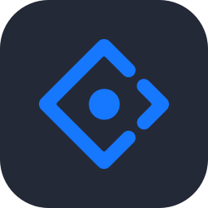
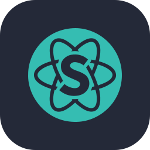

  

  
  

 

<h3 align="center">⚡ Tech Stack</h3>

<table>
  <tr>
    <td align="right"><b>Frontend</b></td>
    <td></td>
  </tr>
  <tr>
    <td align="right"><b>Backend</b></td>
    <td></td>
  </tr>
  <tr>
    <td align="right"><b>Database</b></td>
    <td> </td>
  </tr>
  <tr>
    <td align="right"><b>UI</b></td>
    <td>  </td>
  </tr>
</table>

 

<h3 align="center">📈 GitHub Activity</h3>

  <picture>
    <source media="(prefers-color-scheme: dark)" srcset="https://github-profile-summary-cards.vercel.app/api/cards/stats?username=hlong-dev&theme=github_dark" />
    
  </picture>
  <picture>
    <source media="(prefers-color-scheme: dark)" srcset="https://github-profile-summary-cards.vercel.app/api/cards/most-commit-language?username=hlong-dev&theme=github_dark" />
    
  </picture>

  <picture>
    <source media="(prefers-color-scheme: dark)" srcset="https://raw.githubusercontent.com/Hlong-Dev/hlong-dev/output/github-snake-dark.svg" />
    
  </picture>

  

